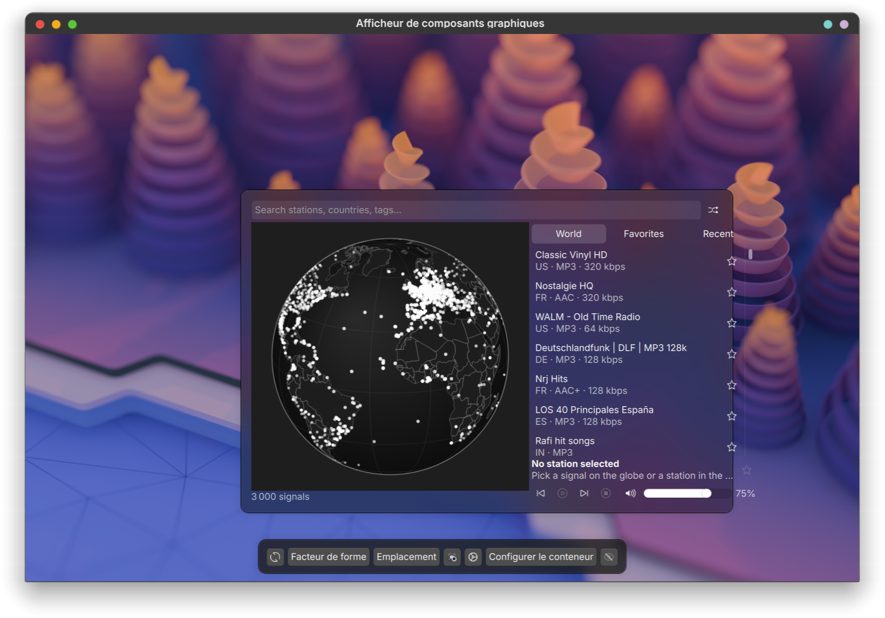

# RadioGlobe

A KDE Plasma 6 widget for exploring live radio stations on a rotatable globe and playing them through mpv.



## Features

- A rotatable, zoomable globe (Canvas 2D) with one point per live radio station. Drag to spin, scroll to zoom, click a point to play, click a country to browse its stations
- Stations come from the [Radio Browser](https://www.radio-browser.info/) community API: world view (up to a configurable cap, default 3000 stations), per-country lists of up to 300 stations, and free-text search across name, country and tag
- Playback through an external mpv process controlled over native MPRIS, so a broken stream can never freeze or crash the widget, and playback survives a `plasmashell` restart
- World / Favorites / Recent tabs, a station list with country, codec and bitrate, and a player bar with previous / play-pause / next / stop / mute / volume / favorite
- Panel or system tray icon with a playing badge, tooltip showing the current station and title, left click to open, middle click for a random station, wheel to change volume, right click for Plasma's widget menu with "Random station" and "Stop and quit mpv"
- Desktop widget form factor with a resizable globe + panel layout, and a compact layout on narrow widths
- Full keyboard control (see Controls below), MPRIS integration with the Plasma Media Controller and multimedia keys
- French translation included, other languages welcome via `po/`

## Requirements

- Plasma 6.1 or newer (`PlayerContainer` needs to exist as a named QML type; developed and tested on Plasma 6.6.6 / Qt 6.10.2)
- [mpv](https://mpv.io/), with the [mpv-mpris](https://github.com/hoyon/mpv-mpris) script installed so mpv publishes an MPRIS interface on D-Bus

| Distribution | Packages |
|---|---|
| Debian / Ubuntu | `mpv mpv-mpris` |
| Arch Linux | `mpv mpv-mpris` |
| Fedora | `mpv mpv-mpris` |
| openSUSE | `mpv mpv-mpris` |

Without mpv-mpris, mpv still plays audio but RadioGlobe cannot control it (no MPRIS interface to attach to), so it is a hard requirement, not an optional extra. The widget's settings page reports whether mpv and mpv-mpris are detected, with the install command for whichever is missing.

## Install

### From the KDE Store

Search for "RadioGlobe" in Plasma's "Get New Widgets" dialog and install it from there.

### From a `.plasmoid` file

```bash
kpackagetool6 --type Plasma/Applet --install radioglobe-<version>.plasmoid
```

To upgrade an existing install, use `--upgrade` instead of `--install`.

### From the repository

```bash
scripts/package.sh
kpackagetool6 --type Plasma/Applet --install dist/radioglobe-<version>.plasmoid
```

`scripts/package.sh` compiles the translations and bundles only what the widget needs. Installing the checkout itself (`kpackagetool6 --install .`) would copy the tests, the docs and `.git` into your widget directory.

Then add "RadioGlobe" from the widget list to a panel, the system tray, or the desktop.

## Controls

### Mouse (compact icon)

| Click | Action |
|---|---|
| Left | Open or close the popup |
| Middle | Play a random station |
| Right | Plasma's widget menu, with "Random station" and "Stop and quit mpv" |
| Wheel | Adjust volume |

### Keyboard (full view)

| Key | Action |
|---|---|
| `/` | Focus the search field |
| Up / Down | Move the list selection |
| Enter | Play the selected list entry, or run the search if nothing is selected |
| Space | Play / pause |
| `R` | Play a random station |
| `F` | Toggle favorite on the selection |
| `+` / `-` | Volume up / down |
| `M` | Mute |
| Escape | Clear the search, then leave the current country, then close the popup |

In the player bar, clicking the stop button stops playback; holding it down quits mpv entirely, like "Stop and quit mpv" in the right-click menu.

## Data and privacy

- Station data comes from [Radio Browser](https://www.radio-browser.info/), a community-run, public-domain database (no attribution required, but credited below anyway)
- RadioGlobe sends a `RadioGlobe/<version>` User-Agent on every request to Radio Browser, as its maintainer asks
- Unless disabled in the settings page ("Report played stations to the click counter"), playing a station calls Radio Browser's click counter. This tells Radio Browser "this IP listened to this station" — it is how popularity and click counts are computed. Turn it off in the widget's configuration if you don't want that
- Audio streams themselves are fetched directly by mpv from each broadcaster's own server, not proxied through Radio Browser or RadioGlobe's author. Whoever runs the station sees your IP address like any other listener, and the rights to what's broadcast belong to that station
- Station metadata (country geometry) comes from [Natural Earth](https://www.naturalearthdata.com/), public domain

## Troubleshooting

**mpv is not found**: the player bar shows an install message with the command for your distribution. Install `mpv` (see Requirements) or set an absolute path to it in the widget's settings.

**mpv-mpris is not found**: RadioGlobe launches mpv, waits a few seconds for it to appear on MPRIS, and if it never does, kills mpv and shows an install message. Install `mpv-mpris` for your distribution (see Requirements) and make sure mpv actually loads it (the script normally lives under `/etc/mpv/scripts/` or a system mpv-mpris plugin directory, loaded automatically). Run `playerctl -l` while a station is playing: `mpv` should be listed as an MPRIS player.

**mpv keeps playing after I close the widget or restart Plasma**: this is intentional. mpv runs as its own detached process so a plasmashell crash or restart (`plasmashell --replace`) does not interrupt playback; the widget reattaches to it automatically. To actually stop mpv, pick "Stop and quit mpv" in the icon's right-click menu, or hold down the stop button in the player bar.

**The mpv path setting doesn't work**: it must be an absolute path (e.g. `/usr/bin/mpv` or `/opt/mpv/bin/mpv`), not a bare command name or a `~`-relative path.

**Radio Browser is unreachable**: RadioGlobe falls back to its last cached station list and shows "Radio Browser unreachable, showing cached data"; the globe stays populated from cache. A Retry button appears next to that message, and reopening the popup retries on its own.

**A station won't play**: some entries in Radio Browser's directory are stale even after its own health checks. RadioGlobe shows an error banner with a retry button after about 15 seconds without a title update; it does not reconnect or skip to another station automatically.

## Development

```bash
tests/run                    # node unit tests, qmllint, qmlformat check, qmltestrunner
scripts/build-translations.sh
plasmoidviewer -a .          # live preview
scripts/package.sh           # builds dist/radioglobe-<version>.plasmoid
kpackagetool6 --type Plasma/Applet --install .   # quick dev loop, see below
```

`kpackagetool6 --install .` installs the checkout as it is, tests and docs included. It is handy to try a branch in a real panel (`--upgrade .` afterwards), but ship and install the `.plasmoid` built by `scripts/package.sh`.

## Credits

- [Radio Atlas](https://github.com/AksharP5/omarchy-radio-atlas) by Akshar Patel (MIT) — the globe rendering and station model this project is built on
- [Natural Earth](https://www.naturalearthdata.com/) — country geometry
- [Radio Browser](https://www.radio-browser.info/) — station data

## License

MIT, with copyright split between Akshar Patel (Radio Atlas code reused here) and Rapha (rcspam) for RadioGlobe. See [LICENSE](LICENSE).
